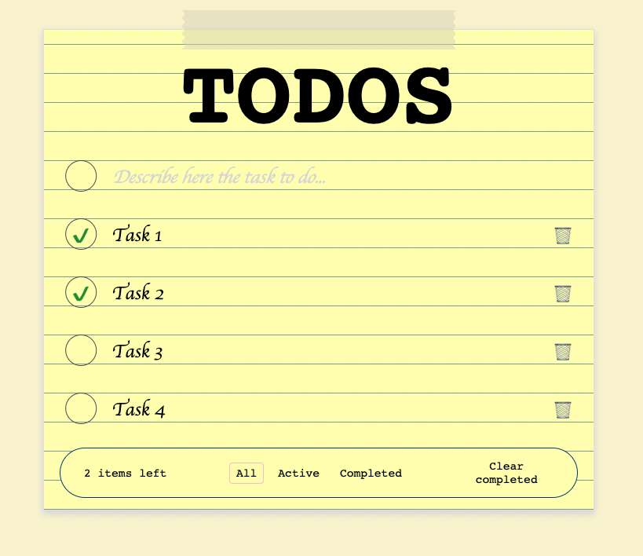

# TODO List Manager

This project defines a user interface for managing a TODO list.

## Development

This project was developed using TDD approach - all of the tests had been written, then the UI had been tested as well.

This project can be started using the script `npm run start:dev`.

## Tests

Tests for the project could be start using the script `npm run test`.

The were created using the `@testing-library/react` library.

Tests are usually divided to the groups: `elements` for tests that validates creation of elements, `props` for tests that validates the component behaviour according to provided props, and `events` for tests that simulates user events.

Testing events using objects from the `@testing-library/user-event` library such: `fireEvent` and `userEvent`.

## Project structure

The project structure is similar to as advised by (Redux's documentation)[https://redux.js.org/faq/code-structure#:~:text=Since%20Redux%20is%20just%20a,containers%E2%80%9D%2C%20and%20%E2%80%9Ccomponents%E2%80%9D].

## Linting and formatting

For linting and formatting, the following scripts could be used: `npm run lint` and `npm run format`.

## Usage example

